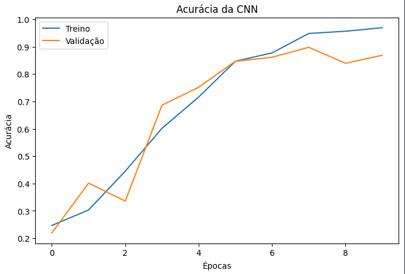
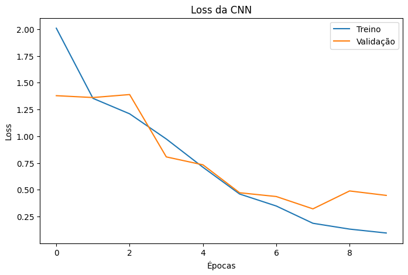
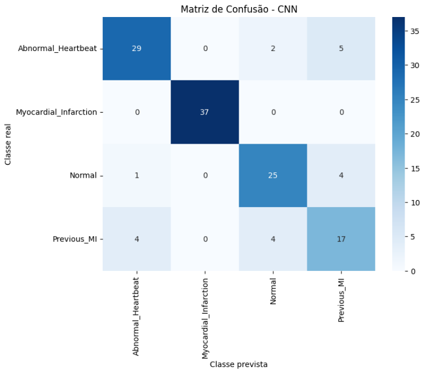
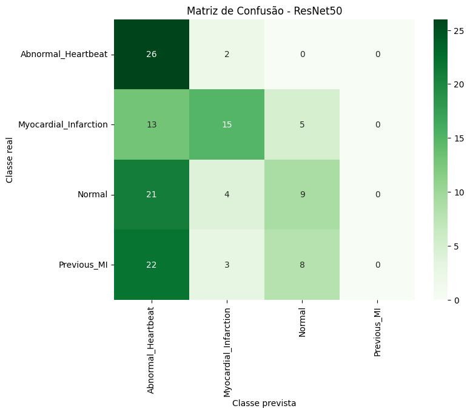
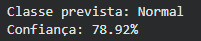

# FIAP - Faculdade de Informática e Administração Paulista

<p align="center">
<a href= "https://www.fiap.com.br/"></a>
</p>

<br>

# Nome do projeto
Fase 4 - Assistente Cardiológico Virtual com Visão Computacional

## Nome do grupo
Grupo 56

## Integrantes: 
- <a href="https://www.linkedin.com/in/anacornachi/">Ana Cornachi - RM 564678</a>
- <a href="https://www.linkedin.com/in/carlamaximo/">Carla Máximo - RM 564845</a>

## Professores:
### Tutor(a) 
- <a href="https://www.linkedin.com/in/lucas-gomes-moreira-15a8452a/">Lucas Gomes Moreira</a>
### Coordenador(a)
- <a href="https://www.linkedin.com/in/andregodoichiovato/">André Godoi Chiovato</a>

## Sobre o Projeto

Este projeto foi desenvolvido para a disciplina Global Solution da FIAP e faz parte do projeto CardioIA: A Nova Era da Cardiologia Inteligente.
Nesta fase, foi implementado um Assistente Cardiológico Virtual baseado em Visão Computacional para classificar imagens de ECG utilizando duas abordagens:
* CNN treinada do zero
* Transfer Learning com ResNet50

## Objetivos

* Aplicar técnicas de pré-processamento em imagens médicas.
* Separar os dados em treino, validação e teste.
* Implementar uma CNN treinada do zero.
* Implementar Transfer Learning utilizando ResNet50.
* Avaliar o desempenho dos modelos utilizando métricas de classificação.
* Apresentar os resultados em um protótipo simples e interpretável.

## Tecnologias utilizadas

* Python
* TensorFlow
* Keras
* Scikit-Learn
* Matplotlib
* Seaborn
* Google Colab

## Dataset

Foi utilizado um dataset público contendo imagens de ECG organizadas nas seguintes categorias:

* Abnormal Heartbeat
* Myocardial Infarction
* Normal
* Previous Myocardial Infarction

Fonte do dataset: ECG Images Dataset of Cardiac Patients (Mendeley Data). (https://data.mendeley.com/datasets/gwbz3fsgp8/2)

Total aproximado: 885 imagens.

## Principais resultados

| Modelo   | Accuracy |
| -------- | -------- |
| CNN      | 84%      |
| ResNet50 | 39%      |

## Resultados da CNN





## Matrizes de confusão

### CNN



### ResNet50



### Protótipo



### CNN Treinada do Zero

* Conv2D
* MaxPooling2D
* Dropout
* Dense
* Softmax

### Transfer Learning

* ResNet50 pré-treinada na ImageNet
* Camadas finais customizadas para classificação das imagens de ECG

## Métricas Avaliadas

* Accuracy
* Precision
* Recall
* F1-Score
* Matriz de Confusão

## Estrutura do Projeto

```text
CardioIA-Fase4/
│
├── CardioIA_Fase4.ipynb
├── dataset/
├── prints/
├── relatorio/
└── README.md
```

## Arquivos do projeto

- CardioIA_Fase4.ipynb: notebook desenvolvido no Google Colab.
- Relatorio_CardioIA_Fase4.pdf: relatório técnico resumido da atividade.
- prints/: imagens dos resultados, métricas e protótipo desenvolvido.

## Aviso

Este projeto possui finalidade acadêmica e experimental. Os resultados gerados pelo modelo não substituem avaliação médica profissional.